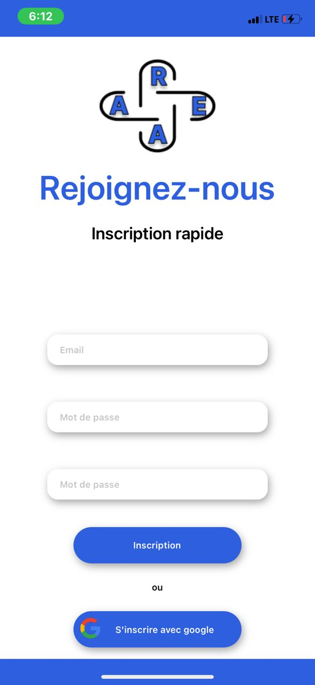
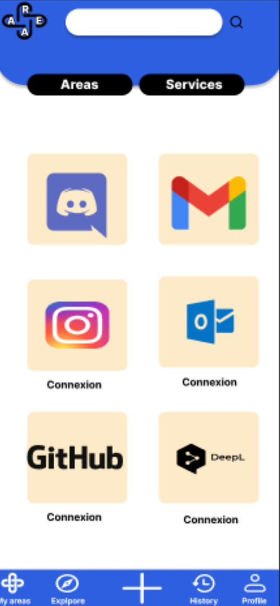
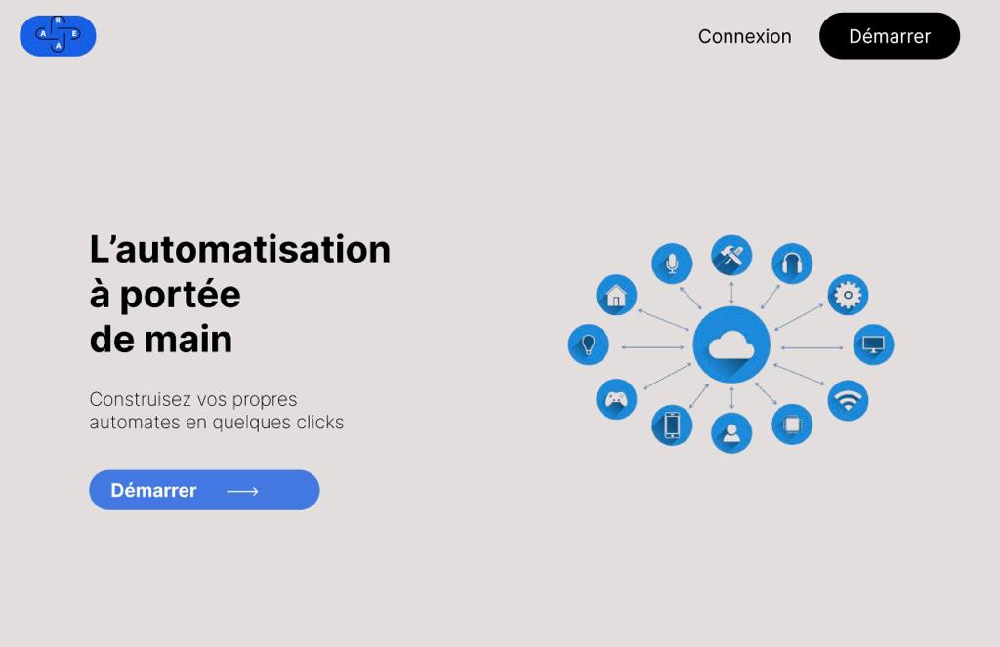

# AREA

## Project overview:

The project aims to create a software suite similar to IFTTT and/or Zapier, allowing users to interconnect various digital services.

 This software suite is divided into 3 parts:

  - A Server: Implements features and exposes functionalities through a REST API.
  - Web Client: Enables users to interact with the application via a web browser.
  - Mobile Client: Allows users to access the application through a mobile device.

## Languages:

This project uses the following languages:

  - Server → Nodejs Express & MongoDB.
  - Web application → React.
  - Mobile application → React Native.

## Documentation:

In the AREA_Documentation/ folder you can find these documents:

  - User's guide → How to use the application.
  - Technical documentation → Technical information about the project.

## Achievement:

### Mobile app:

### Web app:

## Services:

Here are all the different services that you can use:

  - Reddit
  - GitHub
  - Gitlab
  - Gmail
  - Discord
  - OneDrive
  - Youtube

## Made by:

    - Jean-David BAMENOU [jean-david.bamenou@epitech.euepitech]
    - Sedjro HOUNDONOUGBO [sedjro.houndonougbo@epitech.eu]
    - Togni AKPO [togni.akpo@epitech.eu]
    - Olouwachegoun BADOU [olouwachegoun.badou@epitech.eu]
    - Loick MIAN [loick.mian@epitech.eu]
    - Maria Gracia AHOMLANTO [maria-gracia.ahomlanto@epitech.eu]