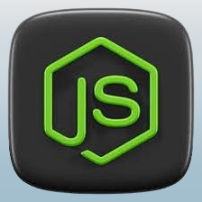

  
## Project overview.
 
The AREA project consists in the creation of a software suite that functions similarly to IFTTT and/or Zapier. 

This software suite is divided into 3 parts: 

  - A server to implement all the features. 
  - A web application to access the app from a browser. 
  - A mobile application to access the app from a phone. 

This project uses the following languages: 

  - Server → Nodejs Express & MongoDB. 
  - Web application → React. 
  - Mobile application → React Native. 

  
  
  

## Libraries used. 

### Mobile:

For project configuration, various dependencies have been integrated to ensure optimal development setup. Here`s an overview of the key dependencies used in this context:

 **Expo Configuration:**

   - `@expo/webpack-config`: Expo-specific Webpack configuration for projects.

 **React Navigation:**

   - `@react-navigation/native`: Integration of navigation in the React Native application.
   - `@react-navigation/stack`: Management of stack-based navigation.
   - `@react-navigation/bottom-tabs`: Implementation of the bottom tab navigation.

 **Axios:**

   - `axios`: HTTP library for making requests from the application.

 **Expo:**

   - `expo`: Platform for developing reactive mobile applications.
   - `expo-splash-screen`: Handling the splash screen for Expo applications.
   - `expo-status-bar`: Reactive status bar for Expo applications.

 **React:**

   - `react`: Version 18.2.0, the latest major version of the React library.
   - `react-dom`: Version 18.2.0, used for React rendering on the web.

 **React Native:**

   - `react-native`: Framework for developing reactive mobile applications.
   - `react-native-web`: Version ~0.19.6, enabling the use of React Native on the web.

This combined configuration reflects a seamless approach for cross-platform development, leveraging the latest features of React and React Native, and providing a consistent development experience across different platforms.

### Web:

For the design of this application, a thoughtful selection of libraries and packages has been made. Here`s an overview of the main dependencies used in the project, with a focus on the latest major versions and key features:

 **Styling Management:**
   - `@emotion/react`: Version ^11.11.1, for styling management with a reactive approach.
   - `@emotion/styled`: Version ^11.11.0, providing styled components with Emotion.

 **Icons and Fonts:**
   - `@fortawesome/fontawesome-free`: Version ^6.5.1, for integrating icons from the Font Awesome library.
   - `@mui/icons-material`: Version ^5.15.0, providing icons for Material-UI components.
   - `react-icons`: Version ^4.12.0, offering a wide selection of React icons.

 **UI Libraries:**
   - `@mui/material`: Version ^5.15.0, for Material-UI components.
   - `bootstrap`: Version ^5.3.2, for responsive styles and UI components.
   - `mdb-react-ui-kit`: Version ^7.0.0, a React toolkit for UI development.

 **Routing and Navigation:**
   - `react-router-dom`: Version ^6.21.0, for handling navigation in the React application.

 **Testing and Code Quality:**
   - `@testing-library/jest-dom`: Version ^5.17.0, for Jest testing utilities.
   - `@testing-library/react`: Version ^13.4.0, for facilitating React testing.
   - `@testing-library/user-event`: Version ^13.5.0, for simulating user events in tests.

 **Development Tools:**
   - `react-scripts`: Version 5.0.1, for React script configuration and management.
   - `web-vitals`: Version ^2.1.4, for monitoring vital aspects of web performance.

 **Other Dependencies:**
   - `@babel/plugin-proposal-private-property-in-object`: Version ^7.18.6, for supporting ECMAScript syntax proposals.

This combination of libraries aims to provide a strong foundation for application development, emphasizing reactivity, aesthetics, and ease of testing. The specified versions ensure project consistency and stability.

## Project structure. 

The project is organized into three directories, each containing the code for its respective part: Front, Mobile, and Server. The project is constructed using Docker, and this will be elaborated in a subsequent section of the document.

## Architecture diagram. 

### Mobile:

### Web:

## APIs used. 

The project uses various APIs for its functionalities.  

We have: 

  - Reddit
  - GitHub
  - Gitlab
  - Gmail
  - Discord
  - OneDrive
  - Youtube

## Database structure. 

This project uses MongoDB as database manager. It is integrated
using NodeJS and Express to manage the interactions between the
front server and the API server.
This database contains several models, such as User (including
one model called Service), AREA (including two models Action and
Reaction) and ConnectSession (used when the user connects to a
service).
Starting with the User model, the schema contains different
fields such as :

  - email : email address (type: String)
  - password : encrypted password (type: String)
  - displayName : username (type: String)
  - connectData : data retrieved when user is connected to a service

  Next, The AREA model will store datas about the action (model
Action) and the reaction (model Reaction) but also the user’s id :
  - userId : user id (type: String)
  - isMobile : to know whether it is from mobile or not (type:
Boolean)
  - action : information about the action (type: ActionSchema)
  - reaction : information about the reaction (type: ReactionSchema)

  ActionSchema is considered as the definition of an Action :
- service : name of the service (type: String)
- name : name of the action (type: String)
- data : all the information of the action (type: Object)
ReactionSchema is considered as the definition of a Reaction :
- service : name of the service (type: String)
- name : name of the reaction (type: String)
- data : all the information of the reaction (type: Object)
ConnectSession is the model we use to manage data when the
user tries to connect to a service :
- userId : user id (type: String)
- endpoint : which endpoint the user is accessing (type:
String)
- isMobile : to know whether it is a mobile request or not
(type: Boolean)
- data : pass data through endpoints and callbacks (type:
String)

## Project build.

This project is constructed using Docker. The project architecture separates the back-end, web, and mobile servers, with each having its own Dockerfile, and a docker-compose.yml file located at the root. The docker-compose.yml file invokes the Dockerfiles in each source (/server/, /front/, & /mobile/) to build the entire project and launch the servers. It also starts mongod and binds it to port 27017, enabling the use of the database in the project.

The Dockerfiles are responsible for building the three folders (server, front, & mobile) so that docker-compose.yml can initiate the complete build. The `docker compose up` command aggregates the output of each container, providing access to the following features:

Front server : localhost:8081

Back server : localhost:8080

Mobile apk download : localhost:8080/client.apk

 **Separate Servers:** Back-end, web, and mobile servers are individually started.
 **Database Access:** Mongod is initiated and bound to port 27017, ensuring database access for the project.
 **Complete Build:** The command performs the full project build using the appropriate Dockerfiles.
 **Combined Output:** Results from each container are consolidated, offering an overview of the Docker project execution.
 **Deployment Ease:** Through docker-compose, the project can be consistently and efficiently deployed.

In summary, leveraging Docker and docker-compose streamlines the process of building, deploying, and managing different components of the project, making development and maintenance more straightforward.
